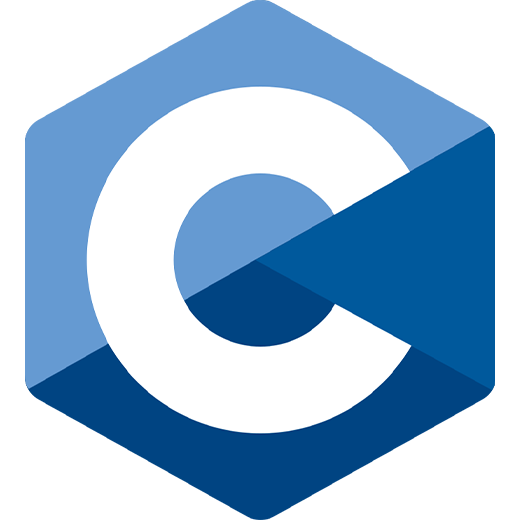
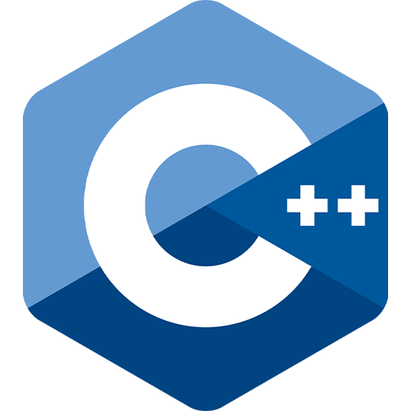
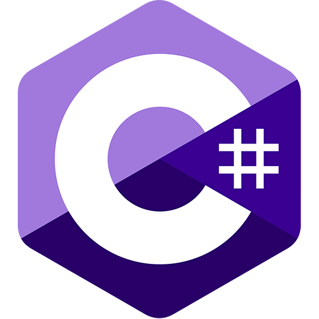
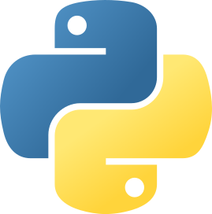
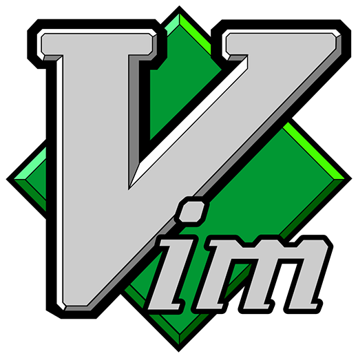
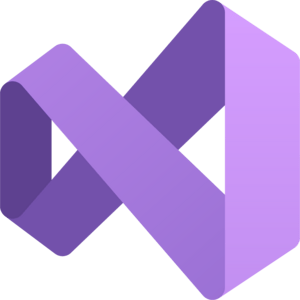
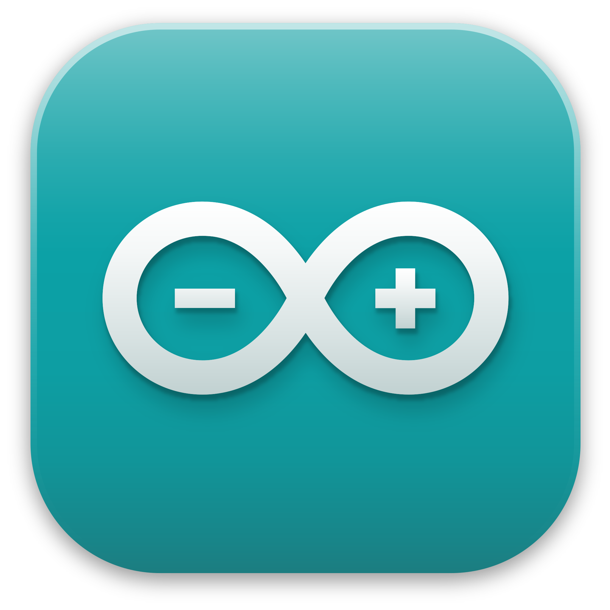

### 👋 Introduction

Hey, my name is Yasser and I like coding so much. I was born in 2007 and that's it pretty much.

### 😄 Hobbies

I love programming, mathematics, and games such as chess.

### 📕 Projects

I have made a lot of projects in my life. However, some of them failed or are delayed. Here are top projects I created:
> **LearnMath** *[Ongoing]*
> 
> **DBManager**
> 
> **MyClicks** *[Dead]*

**NOTE:** There are other projects that are still being made or unlisted. 

### 💻 Tools & Languages

**➤ Languages:**

**➤ Tools:**

### 📫 Trying to reach me?

My Twitter account: [@complexyasser](https://x.com/@complexyasser)

---

    <i>Thank you for reading!</i>

